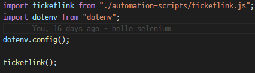

## 버그 발생 상황

Gatsby 업로드를 위해 commit을 헀는데 업로드가 되지 않아 netlify에 접속해보니 production deploy에 failed가 떠있었습니다.

```comment
6:13:20 PM: error Error processing Markdown file /opt/build/repo/content/blog/bugfix/centos-dnf-appstream.md:
6:13:20 PM: can not read a block mapping entry; a multiline key may not be an implicit key at line 3, column 5:
6:13:20 PM: date: 2020-12-14 18:00:00
```

위와 같은 문구가 나오고

기존에 index.js에 쭉 작성했던 코드를 다른 js파일로 옮겨서 module로 import 해 사용하도록 했습니다.

글로 쓰니까 뭔가 장황한데 그냥


이 지경이었던 index.js 파일을



이렇게 정리했다는 얘기입니다.

그런데 그 후 start를 했더니

```linux
Cannot use import statement outside a module
```

위와 같은 에러메시지와 함께 에러가 발생했습니다.

## 원인 확인 및 해결

검색해보니 해결 방법은 간단했습니다.

package.json 파일에


위와 같이

```js
"type": "module"
```

부분을 추가하고 실행하니 이전과 같이 잘 실행되었습니다.

package.json의 "type" 필드에 별도의 값이 없거나 "commonjs"로 설정되어 있으면 기본 모듈 처리 방식이 require를 사용하는 commonjs 방식으로 설정되기 때문에 import 부분에서 에러가 발생했던 것이고 "type" 필드 값을 "module"로 설정한 후엔 모듈 처리 방식이 import를 사용하는 es6 방식으로 변경되었기 때문입니다. (그렇기 때문에 설정을 위와 같이 바꾼 후에는 require로 불러오던 모듈들을 import로 불러오도록 변경해야 합니다. 위에 올린 제 코드에도 보면 dotenv를 require로 가져오다가 import로 가져오도록 변경한 부분을 확인하실 수 있습니다)

## 참조

[SyntaxError: Cannot use import statement outside a module](https://subji.github.io/posts/2020/06/03/nodetypescripterror1)
