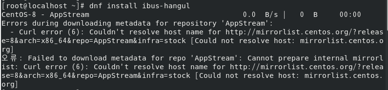
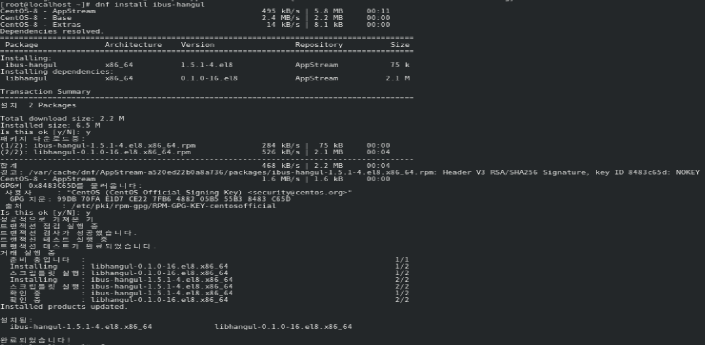

## 버그 발생 상황

Cent OS 8 터미널에서 한글 입력을 하기 위해 ibus-hangul을 다운받으려고

```bash
dnf install ibus-hangul
```

명령어를 입력하자



위와 같은 에러가 발생했습니다.

## 원인 확인 및 해결

검색해보니 굉장히 민망한 이유때문에 발생한 에러였습니다.

인터넷이 연결되어 있지 않기 때문에 발생하는 에러라고 하더군요. Cent OS는 처음 설치했을 때 자동으로 인터넷 연결이 설정되진 않는다고 합니다. 그러니 인터넷을 켜고 다시 원래 입력했던 명령어를 입력했더니



아무 문제 없이 다운로드가 완료되었습니다.

혹시 인터넷을 켜는데 문제가 있다면 아래 참조의 포스팅을 참고하세요!

## 참조

[CentOS 8.1 설치할 때 주의사항(VirtualBox에서 설치할 때 포함) - 인터넷 연결 설정, 부팅 시 오류 메시지](https://wnw1005.tistory.com/353)
