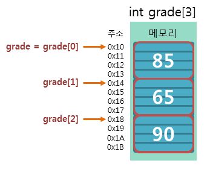
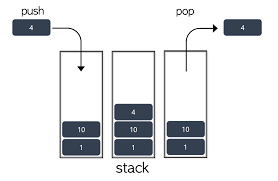
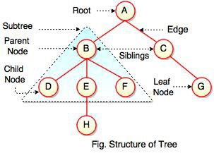
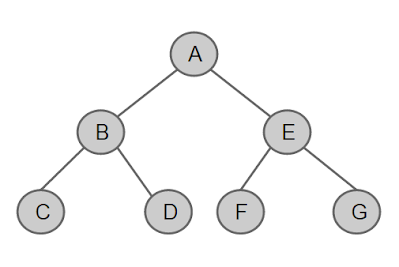
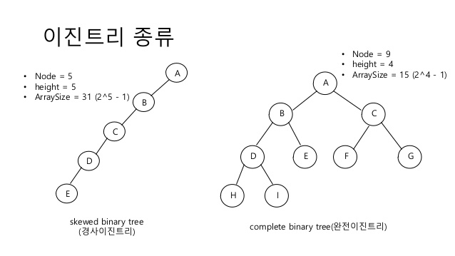
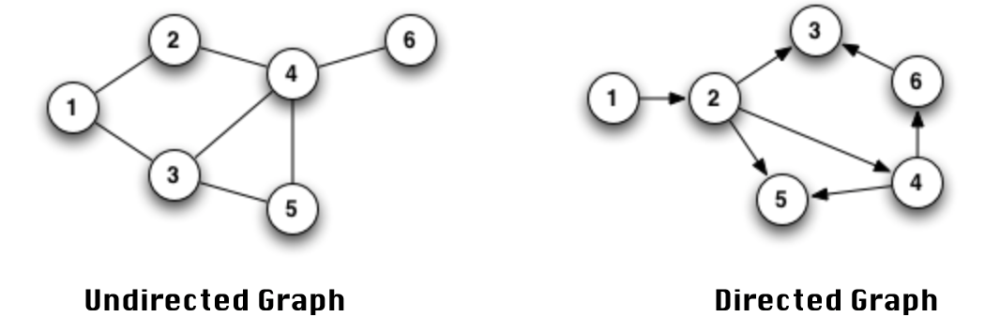

한국 방송통신 대학교 '컴퓨터 과학 개론' 수업을 듣고 공부한 내용을 제 언어로 정리한 포스팅입니다.

## 컴퓨터와 자료

### 컴퓨터

#### 컴퓨터란 무엇인가

컴퓨터는 외부에서 자료와 명령 등을 입력을 받아 이를 처리하고 출력하는 기계입니다. 이 중에서 처리 부분을 담당하는 것은 일련의 명령어 집합이고 이를 프로그램이라 합니다. 즉 컴퓨터는 이 프로그램이 없으면 아무런 처리도 할 수 없지만 이것만 있다면 어디서나 동일한 결과를 신속하게 얻어낼 수 있습니다.

#### 컴퓨터의 발전과 구분

이전에도 기계식 계산장치는 있었지만 최초의 완전 전자식 범용 컴퓨터 (여러 가지 유형의 작업을 처리할 목적의 컴퓨터)인 ENIAC이 등장한 건 1946년입니다. 그러나 이는 메모리에는 데이터만 저장하고 외부에서 전선의 연결 상태를 바꾸거나 스위치의 온/오프를 조정해서 프로그래을 실행하던 방식의 기게로서 지금의 컴퓨터와는 달랐습니다.

지금처럼 데이터 뿐만이 아니라 프로그램도 메모리에 저장하여 처리하는 존 폰 노이만의 내장 프로그램 방식을 따른 최초의 컴퓨터는 EDVAC으로 1950년도에 개발되었고 머지않아 유사한 개념의 EDSAC도 등장했습니다.

이 당시의 1세대 컴퓨터는 모두 진공관을 사용하는 형태라 큰 기관/ 조직에서만 운영할 수 있었는데 진공관 대신 트랜지스터를 사용하는 2세대 컴퓨터가 발명되고, 그 대신 집적회로를 사용하는 3세대 컴퓨터, 나아가 초고밀도 집적회로 (VSLI)를 사용하는 4새대 컴퓨터를 거쳐 현재 사용되는 5세대 컴퓨터까지 발전해오며 가격도 저렴해지고 널리 사용되게 되었습니다.

### 컴퓨터 과학

#### 컴퓨터 과학이란 무엇인가

컴퓨터가 외부에서 자료와 명령등을 입력을 받아 이를 처리하고 출력하는 기계라면, 컴퓨터 과학은 이 중 처리 부분과 관련이 있는 학문입니다. 정확히는 자료의 획득, 표현, 처리, 저장, 통신, 접근을 위한 방법들의 실행 가능성, 구조화, 표현, 기계화에 관련된 내용을 다루는 학문 분야인데 이는 모두 알고리즘의 한계, 분석, 개발, 실행, 표현 및 통신의 관점에서 바라볼 수 있을 정도로 알고리즘이 핵심적인 키워드 입니다.

#### 컴퓨터 과학의 특성

컴퓨터가 등장한지 얼마 되지 않았기 때문에 컴퓨터 과학의 역사는 짧지만 그 발전 속도는 매우 빠르고 범위도 매우 넓은 학문입니다. 비슷한 컴퓨터 공학은 가격 대비 성능 특성이 가장 좋은 컴퓨팅 엔진을 만들기 위해 하드웨어와 소프트웨어의 요소를 조립하는 방법에 관심을 두지만 컴퓨터 과학은 문제 해결에 좀 더 초점을 맞추고 있습니다.

### 컴퓨터 시스템

컴퓨터 시스템은 크게 하드웨어와 소프트 웨어, 자료, 사용자로 구성됩니다.

#### 하드웨어

오늘날의 모든 컴퓨터는 컴퓨터의 내부 구조와 처리 과정을 정의한 폰 노이만 시스템에 기반을 둡니다. 여기서는 컴퓨터의 하드웨어를 기억 장치, 제어 장치, 산술논리연산 장치, 입출력 장치, 이렇게 크게 네 부분으로 나눕니다.

이 중 기억 장치는 다시 주기억 장치(RAM)와 보조 기억 장치(HDD / SDD)로 나뉩니다. 주기억 장치는 큰 용량의 프로그램과 데이터를 담아두기엔 적합하지 않기 때문에 저장 가능 용량이 큰 보조기억장치에 프로그램과 데이터를 담아뒀다가 사용되는 데이터와 프로그램만 주기억 장치에 담아 실행하기 위해 입니다.

제어 장치와 산술논리연산 장치의 역할은 CPU에서 담당합니다. 제어 장치는 메모리에 올라온 명령어를 하나씩 가져와 해석하고 산술논리연산 장치는 해석된 명령을 실행하는 역할을 합니다.
가장 간단한 입출력 장치는 키보드와 모니터처럼 입출력을 담당하는 장치를 말합니다.

#### 소프트웨어

모든 프로그램을 총체적으로 소프트웨어라고 표현합니다. 이는 운영체제, 컴파일러 등이 해당하는 시스템 소프트웨어와 사용자의 요구를 수행하는 응용 소프트웨어로 나눌 수 있습니다.

#### 자료와 사용자

사용자와 자료도 각각 컴퓨터 시스템 중 하나입니다. 단 자료는 컴퓨터가 이해할 수 있게 0과 1이 나열된 비트패턴으로 변환되어 사용되고 출력시에도 비트 패턴의 데이터가 다시 적절한 형태로 변환되어 출력됩니다.

### 자료의 표현

이처럼 0과 1만 사용하는 비트 패턴을 사용하는 이유는 컴퓨터가 트랜지스터라고 하는, 전기로 작동하는 스위치들의 합으로 작동하기 떄문입니다. 1이 이 스위치의 켜진 상태를, 0이 이 스위치의 꺼진 상태를 표현하며 자료를 처리하는 겁니다.

물론 하나의 스위치, 즉 1비트로 자료를 처리할 순 없습니다. 그렇기 떄문에 이를 묶어 사용합니다.비트가 8개 나열되면 바이트, 그 바이트가 1024개가 모이면 킬로 바이트, 그게 다시 1024개가 모이면 메가바이트가 되는 식으로, 기가 바이트, 테라 바이트, 페타 바이트 등의 단위를 사용하며 자료를 처리합니다.

#### 진법

자료를 0과 1로 표현하기 위해 컴퓨터는 2진법을 사용합니다. 진법이란 수를 세는 방법입니다. 우리가 일상적으로 쓰는 10진법은 0부터 9까지의, 10개의 숫자를 이용해 수를 표현하는 방식이고 같은 맥락으로 2진법은 0과 1, 2개의 숫자만을 이용해 수를 세는 방식입니다.

그렇다면 10은 어떻게 읽어야 할까요? 2진법에 대해 몰랐을 때는 고민할 필요도 없는 문제였지만 이제는 십진법의 관점에서 `십`이라고 읽어야 할지 이진법의 관점에서 '일공'으로 읽어야 할지 모호할 것입니다. 그렇기 때문에 기본적으로 십진법을 사용하는, 10을 십으로 읽는 일상에선 그렇게까지 표현할 필요는 없지만 2진법과 10진법을 구분해야 하는 경우에 십진법 10은 10<sub>10</sub>, 이진법 10은 10<sub>2</sub> 와 같이 아래 첨자를 사용해 그 수의 진법을 표현해 줄 수 있습니다.

##### 2진수를 10진수로 변환

진법끼리는 변환도 가능합니다. 우선 2진수를 10진수로 변환하는 방법을 알아보겠습니다. 10진법의 수에서 오른쪽 첫째 자리 각 자리가 10의 0제곱을 곱한 수를, 둘째 자리가 10의 1제곱을 곱한 수를, 셋째 자리고 10의 2제곱을 곱한 수를.. 그렇게 n번째 자리수가 10의 n-1 제곱을 곱한 수라는 걸 생각하면 그렇게 어렵지 않습니다.

만약 2진수 10111이라는 수가 있다면 똑같은 방식으로 2의 n-1제곱을 곱하면 됩니다. 1 x 2<sup>0</sup> + 1 x 2<sup>1</sup> + 1 x 2<sup>2</sup> + 1 x 2<sup>4</sup>를 하면 1 + 2 + 4 + 16이되니 23이 나오고 이것이 2진수 10111을 10진수로 변환한 값입니다. 만약 소수점 이하의 수가 있다면 같은 방식으로 2<sup>-1</sup>, 2<sup>-2</sup>, 2 <sup>-3</sup>을 곱하면 됩니다.

##### 10진수를 2진수로 변환

10진수를 2진수로 변환하기 위해선 일단 그 수를 더이상 2로 나눌 수 없을 때까지 2로 나눠야 합니다. 그 후 마지막 몫과 나머지들을 거꾸로 이어붙이면 그게 2진수가 됩니다. 예를 들어 43을 2진수로 바꾼다고 하면

```text
43/2 = 21 ○○○ 1
21/2 = 10 ○○○ 1
10/2 = 5 ○○○ 0
5/2 = 2 ○○○ 1
2/2 = 1 ○○○ 0
```

의 과정을 거쳐서 101101<sub>2</sub> 가 됩니다. 이는 10진수를 8진수나 16진수로 변환하려 할 때도 나누는 값이 2에서 8이나 16으로 바뀔 뿐 동일한 방법으로 수행할 수 있습니다.

##### 2진수, 8진수, 16진수 간의 변환

8이 2의 3제곱이고 16은 2의 4제곱이라는 걸 생각하면 2진수, 8진수, 16진수 간의 변환은 좀 더 쉽습니다. 2진수와 8진수간의 변환을 예로 들어보자면 2진수를 8진수로 변환하고자 할 때는 2진수를 3자리씩 끊어서 한자리의 8진수로 만든 후 이어 붙이면 되고 반대로 8진수를 2진수로 변환하고자 할 때는 한자리의 8진수를 세자리의 2진수로 변경하면 됩니다. 같은 방법으로 16진수는 이를 4자리로만 수행해주면 됩니다.

ex)

- 11101<sub>2</sub> -> 011/101 -> 35<sub>8</sub>
- 11101<sub>2</sub> -> 01/1101 -> 1D<sub>16</sub>

#### 정수 표현

원래 정수는 소수점 이하의 값을 갖지 않는 수로서 그 범위는 음의 무한대부터 양의 무한대까지 이지만 컴퓨터에서는 메모리가 허용하는 범위까지만 저장하거나 표현할 수 있습니다. 이로 인해 컴퓨터에서 정수를 표현하는 방법은 부호 없는 정수와 부호 있는 정수를 표현하는 방법으로 나뉩니다.

##### 부호 없는 정수

컴퓨터에서 부호 없는 정수를 표현하는 방법은 간단합니다. 부호를 별도로 표현해 줄 필요가 없기 때문에 예를들어 40이라는 정수가 있다면 이를 이진수인 101000으로 변환해 비트에 담아서 표현해주기만 하면 됩니다. 6자리 이진수이니 8비트로 충분히 가능하겠죠. 그러나 275처럼 이진수로 변환 했을 때 100010011이 되는, 9자리 이진수는 8비트로 담을 수 없고 더 큰 그릇이 필요합니다. 그렇지 않고 8비트에 담으려하면 오버플로가 발생합니다. 간단히 정리하자면 부호 없는 정수의 경우엔 0부터 n비트에 2<sup>n</sup>-1까지의 수를 담을 수 있습니다.

##### 부호 있는 정수

부호 있는 정수를 표현하기 위한 방식으로는 크게 부호화-크기 방식과 1의 보수 방식, 2의 보수 방식이 쓰입니다. 이 방식들은 가장 앞쪽 비트를 부호를 나타내는 비트로 사용한다는 공통점이 있지만 음의 정수를 표현할 때 차이를 보입니다.

- 부호화 크기 방식

부호 비트가 0이면 양수를, 1이면 음수를 나타내는 방식입니다. 앞의 비트 하나를 부호비트로 사용하기 때문에 -2<sup>n-1</sup>-1 까지의 수부터 2<sup>n-1</sup>-1 까지의 수를 나타낼 수 있습니다. 그러나 00000000은 0, 10000000은 -0이 되어 0과 -0이 존재하는 문제가 있습니다.

- 1의 보수 방식

1의 보수 방식에선 음의 정수를 표현하기 위해 이진수로 표현된 양의 정수값의 모든 0을 1로, 모든 1을 0으로 바꿉니다. 예를 들어 -124라는 음의 정수를 표현하기 위해선 124의 이진수 값 01111100 (맨 앞의 0은 부호 비트)을 구한뒤 여기의 모든 0을 1로, 모든 1을 0으로 바꿔 10000011 이라고 구하는 방식입니다. 그러나 이 방식 역시도 00000000은 0이고 11111111은 -0이 되어 0과 -0이 존재하는 문제가 있습니다. 또한 표현 가능 범위도 부호화 크기 방식과 동일하게 -2<sup>n-1</sup>-1 까지의 수부터 2<sup>n-1</sup>-1 까지의 수를 나타낼 수 있습니다.

- 2의 보수 방식

2의 보수 방식은 1의 보수 방식에서 1을 더해주는 방식입니다. 이럴 경우 -0이 존재하지 않게되고 -2<sup>n-1</sup> 까지의 수부터 2<sup>n-1</sup>-1 까지의 수까지 표현할 수 있습니다. 또한 산술 연산도 다른 방식보다 편하게 할 수 있기 때문에 컴퓨터에서 정수를 표현할 때는 이 2의 보수 방식이 사용됩니다.

#### 실수 표현

정수와는 달리 소수점 아래의 수가 존재하는 실수를 컴퓨터로 표현하기 위해선 좀 더 다양한 방법들을 동원해 아래와 같은 단계를 거칩니다.

1. 부호를 부호 비트에 저장합니다.
2. 표현하려는 실수를 정수 부분과 소수점 아래 부분으로 나눠 이진수로 변환합니다.
3. 2<sup>n</sup> 또는 2<sup>-n</sup>을 활용해 소수점을 가장 앞에 있는 1 뒤로 옮깁니다. 이렇게 하면 가장 앞에 있는 수가 1이라는 것과 밑이 2가 되는 것은 고정이 되기에 가수 부분과 지수 부분만 저장하면 되기 때문입니다.
4. 그러나 위와 같은 방법을 취하면 지수가 음수가 될 수 있습니다. 그러면 지수를 저장하는데도 별도의 부호 비트를 할당해야 할까요? 그런 방식을 택하지 않기 위해, 할당된 비트가 n비트라면 2<sup>n-1</sup>-1에 해당하는 매직 넘버를 더해 음수 지수가 존재할 수 없도록 만든 후 이진수로 변환해 지수 비트에 저장합니다.
5. 가수 부분을 가수 비트에 저장하고 남는 부분은 0으로 채웁니다.

- 43.6875라는 숫자를 예시로 이 방식을 구현해 보면 각 단계는 다음과 같습니다.

1. 일단 양수기 때문에 가장 앞 부호 비트에 0을 저장합니다.
2. 43과 0.6875를 각각 이진수로 변환해 101011과 1011로 만들고 소수점을 경계로 101011.1011로 표현합니다.
3. 위 숫자를 정규화 과정을 거쳐 1.010111011 x 2<sup>5</sup>로 만듭니다.
4. 8비트에 지수를 저장한다고 가정하고 127을 더해 132를 만든후 이를 2진수 1000100으로 변화해 지수 비트에 저장합니다.
5. 이후 가수 부분인 010111011을 가수 비트에 저장합니다.

이렇게 하면 최종적으로 0 10000100 010111011000000이 됩니다.

#### 문자 표현

컴퓨터에서 모든 자료는 0과 1의 조합으로 표현되기 때문에 문자를 표현하기 위해선 특정 코드에 문자가 매칭되어 있는 코드 체계가 동원됩니다. 보편적으로 ASCII, 유니코드, EBCDIC등이 사용됩니다.

EBCDIC는 컴퓨터 초기 시대 IBM에서 개발한 8비트 코드 체계입니다. 총 256개 문자 코드를 구성할 수 있으나 실제 사용되는 문자 코드 수는 128개 입니다.현재는 IBM 메인프레임을 제외한 다른 컴퓨터에서는 사용되지 안ㅅ습니다.

ASCII는 미국표준협회에서 개발한 코드로서 7비트를 사용해 총 128개의 서로 다른 문자를 표현할 수 있습니다. 실제 사용될 때는 1바이트에 맞추기 위해 왼쪽에 1비트가 추가된 형태로 사용되며 이를 확장된 ASCII라고 부릅니다.

유니코드는 숫자와 알파벳만 부호화할 수 있는 ASCII의 한계를 극보하기 위해 전 세계 컴퓨터 하드웨어 및 소프트웨어 업체들이 모여서 발표한 코드 체계입니다. 1995년 국제 표준으로 젲어되었고 국제 ISO/IEC 10646과 완전히 호환됩니다. 유니코드에서 지원하는 방식은 UTF-8, UTF-16, UTF-32가 있으며 뒤에 붙은 숫자는 인코딩에 사용되는 단위의 비트 수를 의미합니다. UTF-8에서는 ASCII 코드에 해당되는 문자와 유니코드 문자가 동일한 값을 가지기 때문에 이 형태로 인코딩된 유니코드 문자는 기존 소프트웨어에서도 수정하지 않고 사용 가능합니다.

## 자료구조

### 기본 개념

#### 자료구조의 개념

자료 구조는 자료를 추상화하고 논리적 관계를 구조화 한 것 입니다. 자료구조는 프로그래밍 언어에서 제공하는 '미리 정의된 자료구조'와 개발자가 정의하여 사용하는 '사용자 정의 자료구조'로 구분됩니다. '미리 정의된 자료구조'는 정수, 실수, 문자 등과 같은 기본 자료 구조와 여기서 파생된 배열, 구조체, 포인터 등과 같은 파생된 자료 구조로 구성되고 '사용자 정의 자료구조'는 리스트, 스택, 큐, 트리, 그래프 등이 있습니다. 

### 배열

#### 배열의 개념

배열은 동일한 자료형을 가진 여러개의 데이터를 동일한 변수 이름의 방에 일렬로 저장하는 자료의 집합체를 의미합니다. 이 때 이 방에 저장된 각각의 자료는 '원소' 또는 '요소' 라고 하고 이 방에 접근하기 위한 방번호는 '인덱스' 또는 '첨자' 라고 합니다. 이 인덱스는 주로 0부터 시작합니다.

#### 1차원 배열


1차원 배열은 원소들이 1열로만 정렬된 말그대로 1차원인 가장 간단한 형태의 배열입니다. 


배열의 원소들은 컴퓨터 메모리 상에서도 연속적인 기억장소에 순차적으로 할당됩니다. 따라서 0번째 원소가 저장된 메모리 시작 주소를 a라 하고 원소의 크기를 k라 하면 i번째 원소가 저장된 위치는 a+k*i로 구할 수 있습니다.



#### 2차원 배열

2차원 배열은 동일한 크기의 1차원 배열을 여러개 모아놓은 형태의 배열입니다. 2차원 배열은 가로인 행과 세로인 열이 존재하기 때문에 자료에 접근 하기 위해 두개의 인덱스를 사용해야 합니다.


그러나 메모리에 저장될 때는 1차원 배열과 마찬가지로 메모리에 순차적으로 저장됩니다. 이 때 같은 행에 있는 데이터가 다 저장된 후 다음 열의 같은 행에 있는 데이터가 저장되는 형태의 배열을 행우선 순서 배열이라고 하고 같은 열에 있는 데이터가 다 저장된 후 다음 행의 같은 열에 있는 데이터가 저장되는 형태의 배열을 열우선 순서 배열이라고 합니다. 이 둘은 프로그래밍 언어에 따라 다르게 결정됩니다. 


#### 희소행렬

2차원 배열은 그 구조 때문에 행렬을 저장하기 수월합니다. 그러나 특정값이 과반이 넘는 희소 행렬을 그 형태 그대로 2차원 배열로 저장하려면 메모리의 낭비가 너무 심하기 때문에 이럴 경우엔 다른 형태로 저장합니다. 

각각 행, 열, 값을 나타낼  3개의 열과 값의 갯수 만큼의 행을 가지고 있는 배열을 선언해 첫 행엔 총 행,열, 그리고 다른 값을 가진 원소의 개수를 저장하고 그 다음 행부터는 다른 값을 가진 원소의 행 좌표 값과 열 좌표 값, 그리고 원소값 그 자체를 저장하는 방식을 택하는데 이럴 경우 메모리 낭비를 막을 수 있습니다.


### 리스트

#### 선형 리스트

선형 리스트 또는 순서 리스트는 1개 이상의 원소가 순서를 가지고 구성되는 자료 구조입니다. 예를 들어 (월, 화, 수, 목, 금, 토, 일) 은 요일 리스트고 (빨, 주, 노, 초 ,파, 남, 보) 는 색깔 리스트 입니다. 이런 선형 리스트에는 삽입, 삭제, 검색, 정렬 , 호출, 갱신 등의 연산이 적용될 수 있습니다.

#### 선형 리스트의 구현

선형 리스트를 구현하는 가장 간단한 방법은 1차원 배열을 활용하는 것입니다. 그러나 이는 삽입, 삭제시 원소 전체를 앞 뒤로 옮겨야 하는 상황이 발생하는 등 메모리가 비효율적으로 낭비될 수 있기 때문에 실제로 사용되지 않습니다.

그렇기 때문에 선형 리스트의 구현에 주로 쓰이는 방법은 포인터 변수를 활용하는 연결리스트를 활용하는 것 입니다. 원소를 담는 데이터 필드와 다음 노드의 주소를 담는 링크 필드로 구성된 노드들을 활용하는 것인데 이 방식은 추가 노드 삽입/삭제 시에 원소의 위치를 변경할 필요 없이 링크 필드의 주소 값만 변경하면 되기 때문에 불필요한 메모리 낭비를 막을 수 있습니다. 

연결리스트는 단일 연결 리스트와 다중 연결리스트로 나눌 수 있는데 단일 연결 리스트는 바로 뒤의 노드 주소만을 가지고 있어 다음 노드를 찾기엔 수월하지만 바로 앞 노드를 찾기 위해선 이 리스트의 첫 노드 주소를 가지고 있는 head부터 다시 검색해 나가야 하는 단점이 있지만 다중 연결 리스트에는 선행 노드의 주소도 저장할 수 있는 링크 필드도 있어 선행 노드에 대한 접근도 용이합니다.


### 스택과 큐

#### 스택

스택은 삽입과 삭제가 한쪽 끝에서만 이루어지는 자료 구조를 의미합니다. 그 때문에 마지막으로 들어온 자료가 가장 먼저 삭제되는 LIFO (Last in first out, 후입선출)의 특성을 가집니다. 삽입 연산은 Push, 삭제 연산은 Pop이라고 하며 삽입과 삭제가 일어나는 부분을 top이라는 변수가 가리키고 있습니다. 



#### 큐

큐는 삽입은 한쪽 끝에서만 삭제는 반대쪽 끝에서만 이루어지는 자료 구조를 의미합니다. 그 때문에 먼저 들어온 자료가 먼저 삭제되는 FIFO (First in first out, 선입선출)의 특성일 가집니다. 삭제가 이루어질 부분은 front 변수가 삽입이 이루어질 부분은 rear 변수가 가르키는데 rear 변수는 마지막으로 삽입된 데이터 부분을 가르키지만 front 변수는 마지막으로 삭제된 데이터의 앞 부분을 가르킵니다. 이는 큐의 마지막 데이터를 삭제해서 빈 큐가 되었을 때 front와 rear의 값이 같아지게 하기 위함입니다. 


### 트리

#### 트리의 개념

트리는 기업의 조직도처럼 계층적인 관계성을 나타낼 때 사용하는 비선형 자료구조입니다. 트리는 노드와 노드를 연결하는 간선으로 구성됩니다.  트리의 가장 위에 있는 노드를 루트(root) 노드라고 하고 가장 끝에 있는 노드, 노드에 연결된 간선의 개수를 차수(degree)라고 하는데 차수가 0인 노드를 잎(Leaf) 노드라고 합니다. 루트 노드와 잎 노드를 제외한 노드는 모두 내부(internal) 노드라고 합니다.

노드 간의 관계는 부모, 자식, 형제, 조상, 자손 등 가족을 지칭하는 단어로 나타냅니다. 바로 위 노드는 부모(parent) 노드라고 하고 반대로 바로 아래 노드는 자식 (child) 노드라고 합니다. 같은 부모 노드를 갖는 노드는 형제 (sibling) 노드 라고 부르고 루트 노드로부터 어떤 노드 X까지의 경로에 있는 모든 노드는 X의 조상(ancestor) 노드, 어떤 노드 X부터 잎 노드 까지의 경로에 있는 모든 노드는 자손(descendant) 노드라고 합니다.

루트 노드로부터의 거리를 의미하는 레벨(level)이란 개념도 있는데 루트 노드로부터 루트 노드까지의 거리는 0이라 0부터 시작하기 떄문에 트리의 깊이 또는 높이는 루트 노드로부터가장 긴 경로에 있는 단말 노드의 레벨에 1의 값을 더한 것 입니다. 

마지막으로 특정 노드를 루트 노드로 하여 아래에 있는 연결된 구조는 서브트리라고 하고 n개의 서비트리를 가진 트리에서 루트 노드를 제거해서 얻을 수 있는 분리된 서브트리의 집합을 숲이라고 합니다.



#### 이진 트리

이진 트리는 모든 노드의 차수가 최대 2를 넘지 않는 트리를 의미합니다. 이러한 특성 때문에 이진 트리는 노드의 개수만 알면 최대 높이와 최소 높이를 구할 수 있는데 노드의 개수가 N이라면 경사 이진 트리 형태로 쭉 뻗어나가는 경우가 최대 높이를 가지는 경우가 되어 최대 높이는 N이 되고 모든 노드의 차수가 2인 경우가 최소 높이를 가지는 경우가 되어 log<sub>2</sub>N + 1이 최소 높이가 됩니다. 

이진트리의 주요 연산은 삽입, 삭제, 순회가 있는데 그 중 순회 연산은 일정한 순서에 따라 트리에 있는 각 노드를 한번씩 방문하는 것 입니다. 순회의 방법은 루트 노드를 어느 시점에 방문하느냐에 따라 크게 세가지로 나눌 수 있는데 가장 먼저 루트 노드를 방문하는 전위(preorder) 순회와 왼쪽 서브트리와 오른쪽 서브트리 방문 사이에 루트 노드를 방문하면 중위(inorder) 순회, 좌우의 서브트리를 모두 방문한 다음 루트 노드를 방문하는 후위(postorder) 순회로 나눌 수 있습니다.

#### 특수한 조건을 갖는 이진 트리

포화 이진트리(full binary tree), 완전 이진트리(complete binary tree), 경사 이진트리(skewed binary tree)는 특수한 조건을 갖는 이진트리입니다. 

먼저 포화 이진트리는 가질 수 있는 최대 갯수만큼의 노드를 가진 이진 트리를 말합니다. 이진 트리의 깊이를 k라고 하면 가질 수 있는 최대 노드 갯수는 2<sup>k</sup>-1인데 포화 이진 트리는 그만큼의 노드를 가지고 있는 이진 트리입니다. 따라서 모든 레벨에서 빈 자리가 없이 노드를 가득 가지고 있습니다.



완전 이진트리는 최대 레벨이 K일때 레벨 K-1까지는 포화이진 트리를 형성하고 마지막 레벨 k에서는 왼쪽에서부터 오른쪽으로, 노드가 순서대로 채워진 트리입니다. 즉 포화 이진 트리는 완전 이진 트리 이기도 합니다. 

경사 이진트리는 한쪽 방향으로만 가지가 뻗어 나간 이진 트리를 말합니다.



### 그래프

#### 그래프의 개념과 용어

그래프는 정점(vertex)과 정점들을 잇는 간선(edge)으로 이루어진 자료구조 입니다. 그래프는 간선이 방향성을 가지는 방향 그래프(directed graph, digraph)와 간선이 방향성을 가지지 않는 무방향 그래프 (undirected graph) 로 나눌 수 있습니다.



그래프에서 두 정점이 하나의 간선으로 연결되어 있으면 인접(adjacent)해 있다고 하고, 해당 간선은 두 정점에 부수(incident)되었다고 합니다. 즉 인접하다는 정점과 정점간의 관계를 나타내는 표현이고 부수되었다는 정점과 간선간의 관계를 나타내는 표현입니다.

두 정점이 서로 연결되어 있다면 두 정점 사이에 경로(Path)가 존재한다는 것입니다. 이 경로는 정점들의 순차적 나열로 표현합니다. 또한 경로는 구분이 가능한데 경로상에 존재하는 정점들이 모두 다르면 단순 경로, 세개 이상의 정점을 가진 경로 중에서 시작 정점과 끝 정점이 같은 경로를 사이클, 시작 정점과 끝 정점을 제외하고 모든 정점이 다른 사이클을 단순 사이클이라고 합니다.


#### 그래프의 표현

#### 그래프의 탐색

## 알고리즘

### 알고리즘의 기본 개념

#### 알고리즘의 정의와 요건

#### 알고리즘 생성 단계

#### 자료구조와 알고리즘의 관계

### 알고리즘의 설계

#### 분할정복 방법

#### 동적 프로그래밍 방법

#### 욕심쟁이 방법

### 알고리즘의 분석 및 성능 표현

#### 정확성 분석

#### 효율성 분석

#### 점근 성능

### 정렬 알고리즘

#### 선택 정렬

#### 버블 정렬

#### 삽입 정렬

#### 퀵 정렬

#### 합병 정렬

### 탐색 알고리즘

#### 순차 탐색

#### 이진 탐색

#### 이진 탐색 트리

#### 해싱

## 컴퓨터 구조

### 컴퓨터 하드웨어의 기본 구성

### 불 대수와 논리회로

### 조합회로와 순차회로

#### 조합회로

#### 순차회로

### 기억장치

#### ROM

#### RAM

#### 기억장치의 계층구조

### 명령어

#### 명령어 종류

#### 명령어 형식

#### 주소지정방식

### 중앙처리장치

#### 레지스터

#### 처리장치

#### 제어장치

### 입출력장치

#### 입출력 시스템의 기본 구성요소

#### 입출력 제어 방식

#### 입출력장치의 전용

### 병렬처리

#### 파이프라인 처리기

#### 멀티코어 구조

## 운영체제

### 운영체제의 개념

#### 운영체제의 개요

### 운영체제의 주기억장치 관리

### 프로세서 관리

### 장치 관리와 파일 관리

## 프로그래밍 언어

### 개요

### 프로그래밍 언어의 파싱 트리

### 프로그램에서 실행 가능 코드로의 변환

### 프로그래밍 언어의 기본 공통 개념

### 변수의 수명

### 객체지향 프로그램을 위한 추상 자료혀

## 데이터베이스

### 데이터베이스 개념

### 데이터베이스 시스템

### 데이터 모델링

### SQL

## 컴퓨터 네트워크

### 컴퓨터 네트워크의 개요 및 발전 역사

### 통신의 기초

### 컴퓨터 네트워크의 구성

#### 컴퓨터 간의 연결 방식

#### 네트워크 간의 연결 방식

### 네트워크 시스템의 계층적 구조

#### OSI 참조 모델

#### TCP/IP

### 인터넷

#### 데이터 계층 프로토콜

#### 네트워크 계층 프로토콜

#### 전송 계층 프로토콜: TCP

#### 응용 계층 프로토콜

#### 도메인 이름 시스템
