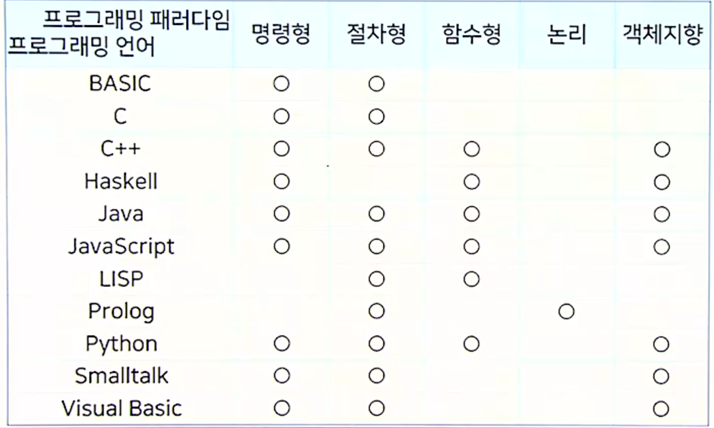

## 프로그래밍 언어 소개

### 프로그래밍 언어란 무엇인가

#### 언어란

- 의사 전달 수단
- 한 사람의 생각을 다른 사람에게 전달하는 데 사용
- 자연어는 크게 말과 글, 두가지 형태로 존재

#### 프로그래밍 언어란

- 프로그램(컴퓨터가 수행할 명령어를 순서대로 나열해 둔 것) 작성에 사용되는 언어
- 사람의 생각을 기계에 전달하는 의사 전달 수단. (하지만 작성에 있어서 사람도 고려해야 함.)
- 즉, 프로그래밍 언어는 컴퓨터가 수행할 수 있고 사람이 읽을 수 있는 형태로 계산( 주어진 입력으로부터 원하는 답을 찾기 위해 수행해야 하는 명확한 절차 - 이 절차가 유한한 단계 안에 끝나야 비로소 알고리즘이라 부른다 )을 나타내는 표기 체계이다.

#### 프로그래밍 언어의 특징

|        |   자연어   |          프로그래밍 언어 |
| ------ | :--------: | -----------------------: |
| 형식   |  말과 글   |                  주로 글 |
| 내용   | 모호, 함축 | 엄밀한 규칙, 정확한 의도 |
| 방향성 |   양방향   |                   단방향 |

#### 프로그래밍 언어를 배워야 하는 이유

- 프로그래밍에 대한 사고 능력을 확장시켜 줌
- 문제 해결자로서 현명하게 언어를 선택할 수 있도록 해 줌
- 언어 사용자로서 언어를 자세히 배울 수 있도록 해 줌
- 현명한 관리자, 현명한 설계자가 될 수 있도록 함

#### 프로그래밍을 배워야 하는 이유

- 체계적으로 생각하는 방법을 가르쳐 줌
- 변화를 표현하는 방법을 가르쳐 줌

### 프로그래밍 언어의 기능

#### 프로그래밍 언어의 기본 기능

- 작성력 : 프로그래머의 의도를 나타낼 수 있도록 하는 기능
- 가독성 : 프로그램을 쉽게 해독할 수 있도록 하는 기능
- 실행 가능성 : 컴퓨터에서 실행될 수 있도록 하는 기능

#### 프로그래밍 언어의 부가 기능

- 추상화 : 어떤 대상을 간략하게 추려 나타내는 방법
- 모듈화 : 복잡한 대상을 나누어 구성할 수 있는 방법

#### 프로그래밍 언어의 특성

- 기계적 : 일을 기계적으로 처리할 수 있어야 함 - 엄밀한 규칙에 따라 정의
- 구조적 : 복잡한 구조를 나타낼 수 있어야 함 - 자료 구조, 제어 구조
- 가변적 : 시대의 필요에 따라 바뀔 수 있음 - Python : 명령형 언어로 시작했으나 현재는 객체지향 개념까지 탑재

#### 프로그래밍 언어 스펙트럼

프로그래머 - 요구사항 -> 프로그래밍 언어 <- 제약사항 - 컴퓨터 구조

<------------------------ 추상화 수준 ----------------------------

고급 언어(기계에 독립적 - c,Java, Python) 저급 언어 (기계에 종속적 - 기계어 어셈블리어)

### 프로그래밍 언어의 구성 요소

#### 데이터

- 자료를 프로그램이 처리할 수 있는 형태로 나타낸 것
- 수, 문자, 문자열, 멀티미디어 등

##### 분류

- 이진 데이터 : 이진수의 나열로 이루어진 데이터
- 텍스트 데이터 : 문자열을 나타내는 데이터

#### 연산

- 데이터 처리 방법
- 연산 적용 후 새로운 데이터를 결과로 얻음

##### 용어 정의

- 연산자 : 특별한 연산을 수행하는 함수
- 변수 : 연산 결과를 저장하는 이름

##### 연산 표현 구조

- 수식 : 값을 나타내는 표현
- 문장 : 처리를 나타내는 표현

#### 명령어

- 특정 작업을 지시하는 단어
- if, while 등

#### 연산 및 명령어

- 대부분의 프로그래밍 언어는 다양한 연산자와 명령어를 통해 수식과 문장을 구성

##### 연산의 종류

- 원시 연산 : 언어가 기본적으로 제공하고 있는 연산
- 사용자 정의 연산 : 프로그래머가 추가로 정의한 연산
- 라이브러리 : 사용자가 자주 사용할 만한 연산을 미리 정의해 둔 것

#### 서브프로그램

- 전체 프로그램을 이루는 작은 코드 블록에 이름을 붙인 것
- 서브루틴이라고 부르기도 함

##### 서브프로그램 분류

- 함수 : 연산 수행 결과 값을 반환하는 서브프로그램
- 프로시저 : 결과 값을 반환하지 않는 서브프로그램

#### 타입

- 데이터 집합과 연산 집합을 합친 개념
- 연산의 안정성 보장을 위해 필요

##### 타입 안정성

- 함수 f의 타입이 f(x):A -> B 라면 모든 a ∈ A 에 대해 f(a) ∈ B여야 함

##### 프로그래밍 언어의 분류

- 강타입 언어 : 타입 오류를 모두 검출하는 언어
- 약타입 언어 : 일부 타입 오류를 허용하는 언어
- 무타입 언어 : 타입 선언문도 없고 어떤 대상의 타입이 계속 변경될 수 있는 언어

#### 모듈

- 독립적인 프로그램 구성 단위
- 서브프로그램도 모듈의 일종

##### 특징

- 내부와 외부를 구별하며 독자적인 이름 공간을 차지
- 변수, 함수, 타입 등 프로그래밍 언어에서 제공하는 거의 모든 것을 포함하는 단위

### 프로그래밍 언어의 학습 방법

#### 프로그래밍 언어의 두가지 측면

- 프로그램 형태 (구문론)
  - 작성한 프로그램
  - 데이터
  - 연산
- 수행 과정 (의미론)
  - 실행시 프로세스
  - 메모리
  - 수행 흐름

#### 어떻게 프로그래밍 언어를 배워야 하나

- 좋은 프로그램을 많이 읽어야 함
- 프로그램을 많이 작성해 봐야 함
- 직접 실행해보며 많이 생각해 봐야 함

#### 프로그래밍 언어의 선택 방법

- 초보자

  - 자신이 조금이라도 아는 언어
  - 사용해 볼 수 있는 언어
  - 주위에서 정보를 얻을 수 있는 언어
  - 프로그램을 관리하기 쉬운 언어

- 숙련자

  - 자신의 업무 분야에서 사용되는 언어
  - 자신이 아는 언어와 유사한 언어

#### 프로그래밍 언어의 학습 요령

- 눈보다 손
- 그림으로 생각
- 점진적으로 변경

#### 왜 프로그래밍 언어론을 배워야 하나

- 새로운 프로그래밍 언어를 쉽게 습득하기 위해서
- 내가 사용하는 언어를 더 잘 이해하기 위해서
- 현명한 언어 설계자가 되기 위해서

## 프로그래밍 언어의 발전 및 동작원리

### 프로그래밍 언어의 발전

#### 컴퓨터 시스템과 운영체제의 발전

##### 컴퓨터 시스템의 발전

- 아이디어 시대 : 계산 자동화를 위한 상상 속의 기계 설계 (튜링 기계)
- 전자식 컴퓨터 등장 : 전자 신호를 통한 계산 기계 (에니악, 콜로서스)
- 프로그램 저장 방식의 컴퓨터 : 프로그램과 처리기를 분리 (에드박)

##### 운영체제의 발전

- 일괄처리 운영체제 : 관리자(operator)를 대신할 프로그램 등장
- 시분할 운영체제 : 한 컴퓨터를 여러 사람이 사용
- DOS : IBM 컴퓨터, Apple 등 개인용 컴퓨터(PC) 등장
- PC 환경 운영체제 발전 : GUI 운영체제와 Linux의 발전

##### 1950년대 : 초기 프로그래밍 언어

- Fortran : 수식과 문장, 제어문의 등장
  - IBM의 존 배커스에 의해 개발됨
  - 과학계산용 언어
- Algol : 구조화 프로그래밍의 발전
  - 본래 이름 : IAL
  - 국제 위원회 ACM-GAMM을 통해 설계된 언어
  - 알고리즘 기술 언어
- LISP : 초기 함수형 언어
  - MIT 의 존 매카시가 설계함
  - 최초의 함수형 언어

##### 1960년대 : 프로그래밍 언어의 발전

- Cobol : 레코드 타입의 소개
  - 미 해군에서 그레이스 호퍼가 이끄는 팀에 의해 개발됨
  - 사무용 언어
- PL/1 : 너무 복잡한 언어
  - 나온 모든 언어를 합쳐 보았으나 결과적으로 너무 복잡해짐
- BASIC : 교육용 언어
  - Beginner's All-purpose Symbolic Instruction Code
- Simula : 객체지향의 등장
  - 시뮬레이션 언어

##### 1970년대 : 프로그래밍 언어의 단순화

- Pascal : 차세대 교육용 언어
  - 구조화 프로그래밍 지원
- C : 진정한 시스템 프로그래밍 언어
  - Unix 개발용 시스템 프로그래밍 언어
  - Objective-C, C++, Java, C# 등 다양한 언어에 지대한 영향을 끼침
- Prolog : 선언적 논리 언어
  - 최초의 논리 언어
- Smalltalk : 객체 지향 언어의 발전
  - 최초로 GUI, 마우스 등을 도입
- Ada : 안정성을 위한 대장정
  - 미 국방성 (DoD) 공모
  - 매우 복잡한 언어로 1983년에 첫 컴파일러 등장
- ML : 타입 시스템을 갖춘 현대 프로그래밍 언어
  - 강력한 정적 타입 검사, 타입 추론, 패턴 검사, 예외 처리 등
- Scheme : 간결한 LISP
  - MIT 학생들의 기초 프로그래밍 언어

##### 1980년대 : 현대 프로그래밍 언어 등장

- Common Lisp: 방대한 LISP의 통합
  - 함수형 언어 패러다임과 객체지향 패러다임을 동시에 지원
- Objective-C : C의 탈을 쓴 Smalltalk
  - C를 기초로 한 객체지향 언어의 신호탄
  - Apple의 애플리케이션 작성 언어로 발전
- C++ : 객체지향으로 변신한 C
  - 클래스 개념을 C에 도입
- Perl : 문자열 처리를 위한 언어
  - 정규식을 바탕으로 한 강력한 패턴 매칭 기능 포함

##### 1990년대 이후 : 프로그래밍 언어의 대중화

- Java : 단순한 객체지향 언어

  - 원래 목적은 임베디드 컴퓨팅 분야였으나 웹 브라우저에 탑재되면서 인기
  - JVM (Java Virtual Machine)

- JavaScript : 웹 프로그래밍 언어

  - Netscape
  - Elm, TypeScript 등 다양한 변종 언어로 발전

- Python : 빠른 프로토타이핑 언어

  - 스크립트 언어
  - 동적 언어를 추구
  - 다중 패러다임 언어

- Haskell : 순수 함수형 언어
  - 모나드(monad)가 탑재되면서 점차 인기
  - Scala에 영향을 줌

### 프로그램 동작 원리

#### 컴퓨터 구조와 프로그램 동작 원리

##### 컴퓨터 구조

- CPU와 메모리, 저장장치 등이 BUS로 연결
- 다양한 입출력 장치도 BUS에 연결될 수 있음

##### 컴퓨터 동작 원리

- 전원 : 운영체제 적재 (저장장치 -> 메모리) -> 수행
- CPU는 인출-해석-실행의 주기를 반복하여 메모리의 명령어를 실행

##### 프로그램의 동작 원리

- CPU는 인출-해석-실행의 주기를 반복하여 메모리의 명령어를 실행

#### 프로그래밍 언어 구현이 필요한 원리

##### 기계어

- CPU가 이해하고 수행하는 명령어
- 이진수 형태의 명령어를 사람이 이해하는 것은 매우 난해

##### 어셈블리어

- 기계어에 거의 일대일 대응하는 형태의 기호 언어
- CPU에 종속적 -> 이식성이 거의 0

##### 고급 프로그래밍 언어

- 사람에 가까운 표현으로 프로그램을 나타냄
- 특정 기계에 종속적이지 않음
- 프로그램을 CPU가 알아듣는 기계어로 표현해 주어야 함
  - 소스 프로그램: 프로그래머가 작성한 프로그램
  - 목적 프로그램 : 컴퓨터 하드웨어가 수행할 수 있는 프로그램

#### 프로그래밍 언어의 구현 방법

##### 인터프리터

- 프로그래밍 언어로 작성된 고수준의 명령을 해석하여 수행하는 프로그램
- 인터프리터는 CPU의 인출-해석-생할의 주기를 흉내냄

##### 컴파일러

- 프로그램을 CPU가 수행할 수 있는 형태로 바꾸어서 CPU가 실행
- 인터프리터가 하는 해석 과정을 미리 모두 수행 (효율적)
- 상용 프로그램은 컴파일 방식으로 번역된 후 판매

##### 하이브리드 구현

- 인터프리터 방식과 컴파일러 방식을 조합한 방식
- 중간코드까지 컴파일한 후 인터프리터를 통해 해석
- 이 인터프리터를 가상기계(VM)라고 부름

### 프로그래밍 언어의 평가 기준

#### 프로그래밍 언어의 요구사항 및 설계 원칙

##### 요구사항

- 표현 풍부성 (expressiveness) : 프로그래머의 아이디어를 표현할 수 있어야 함
- 유지 보수성 (maintainability) : 변화에 쉽게 대처할 수 있어야 함
- 실행 가능성 (executability) : 컴퓨터에서 실행할 수 있어야 함

##### 설계 원칙

- 규칙성 (regularity) : 언어의 기능이 잘 조합될 수 있어야 함 (일반성, 직교성, 일관성)
- 추상화 지원 (support of abstraction) : 실세계의 대상을 추상화하여 나타낼 수 있고 이를 대상으로 어떤 연산을 수행할 수 있어야 함 (데이터 추상화, 제어 추상화, 추상 데이터 타입 정의)
- 복잡도 제어 (complextiry control) : 복잡한 대상 및 처리 방법을 제어할 수 있어야 함 (캡슐화, 모듈화)

#### 평가기준

- 작성력: 프로그램 수식이나 문장, 기능을 쉽게 표현할 수 있는가
- 가독성: 작성된 프로그램을 보고 쉽게 이해할 수 있도록 하는가
- 신뢰성: 작성된 프로그램이 오류에 빠지는 가능성을 주이는가
- 직교성: 언어 기능이 서로 간섭하지 않고 자유롭게 조합될 수 있는가
- 일관성: 유사한 기능을 같은 형태로 나타낼 수 있는가
- 확장성: 사용자가 원하는 새로운 기능을 추가할 수 있는가
- 효율성: 작성된 프로그램이 효율적으로 수행될 수 있도록 하는가
- 유연성: 프로그래머가 표현하고 싶은 내용을 유연하게 수용한느가
- 이식성: 프로그램을 다른 실행 환경으로 이전할 수 있는가

#### 프로그래밍 언어의 평가 기준 사이의 절충

- 검사 비용을 줄여야 함 (효율성) <-> (신뢰성) 더 많이 검사해야 함
- 간단한 기능이 이해하기 쉬움 (가독성) <-> (작성력) 복잡하더라도 많은 기능이 지원되어야 함
- 안전을 위해 더 많은 제약을 가해야 함 (신뢰성) <-> (유연성) 프로그램 작성 시 제약이 적어야 함

#### 프로그래밍 언어의 선택 기준

- 해당 프로그래밍 언어를 사용하는 커뮤니티가 활발하고 호의적인 언어
- 특정 응용 분야가 존재하는 프로그래밍 언어
- 접해 보지 못한 프로그래밍 패러다임을 지원할 수 있는 프로그래밍 언어

## 프로그래밍 언어 패러다임

### 프로그래밍 패러다임

#### 패러다임이란 무엇인가

- 한 시대의 견해나 사고를 규정하는 양식, 규범, 체계 등을 통칭하는 말
- 토마스 쿤은 과학 분야의 발전에 따라 이전의 믿음과 체계가 흔들리고 새로운 체계로 대체되는 과정에 주목
  - 패러다임 전환 ex) 천동설 -> 지동설, 저축이 미덕 -> 소비가 미덕

#### 프로그래밍의 패러다임

- 프로그램을 작성하는 전형적인 방식
- 특정 언어에 종속적인 것이 아닌 프로그래머가 추구하는 프로그램 작성 방식

#### 프로그래밍 패러다임의 변화

- 명령형 프로그래밍 패러다임 등장 : 주어진 데이터에 어떤 연산을 어떤 순서로 할지 결정하는 것이 중요
- 절차형 프로그래밍 패러다임 등장 : 복잡한 데이터 처리를 위해 데이터 처리 방식 자체를 잘 정리하는 것이 중요
- 함수형 프로그래밍 패러다임 등장 : 데이터가 저장된 메모리를 관리하는 것이 어령누 문제로 대두
- 논리 프로그래밍 패러다임 등장 : 계산 절차릴 문제의 조건을 명시하는 규칙으로 생각 (선언전 프로그래밍 패러다임의 한 종류)
- 객체지향 프로그래밍 패러다임 등장 : 같은 데이터에 대해 다른 처리 절차를 여러 개 명시해야 하는 경우가 흔히 발생

#### 프로그래밍 패러다임 변화의 배경

##### 응용 도메인의 변화

- 요구사항의 변화
- 계산 분야 -> 다양한 응용 분야

##### 프로그램 구성 방식의 변화

- 명령어 나열 -> 존재하는 모듈의 조합

##### 계산 모델의 변화

- 튜링기계 모델 -> 새로운 방식의 계산 모델

### 프로그래밍 언어의 패러다임

#### 프로그래밍 패러다임 vs 프로그래밍 언어의 패러다임

##### 프로그래밍 패러다임

- 프로그램을 작성하는 방식이나 스타일

##### 프로그래밍 언어의 패러다임

- 해당 프로그래밍 언어가 지원하는 프로그래밍 패러다임
- 일반적으로 프로그래밍 언어는 여러 프로그래밍 패러다임을 지원

##### 주요 언어의 프로그래밍 패러다임



#### 프로그래밍 패러다임의 양립성

- 다양한 프로그래밍 패러다임은 서로 양립할 수 있음
- 새로운 패러다임의 등장으로 이전에 있던 패러다임이 더욱 공고히 완성
- 주류 프로그래밍 패러다임이 바뀜에 따라 이를 언어가 수용하는 형태로 변화
  - ex) python : 명령형 패러다임, 절차형 패러다임 지원 -> 함수형 패러다임, 객체지향 패러다임을 포함

### 여러 패러다임의 프로그램 예

#### 명령형 프로그래밍

- 프로그램 : 일련의 명령어 나열
- 장점: 프로그램을 쉽게 이해할 수 있음
- 단점 : 프로그램이 복잡한 경우 효과적으로 다루지 못함
- ex) Basic

#### 절차형 프로그래밍

- 프로그램 : 서브루틴이라는 절차의 집합
- 장점 : 재귀호출을 사용하여 프로스저를 간단하게 정의
- ex) Algol

#### 구조화 프로그래밍

- goto 없이 프로그램을 작성하는 방법
- 블록과 서브루틴을 이용
- 구조화된 제어문을 사용
- ex) C

#### 객체지향 프로그래밍

- 프로그램: 서로 통신할 수 있는 객체(object)의 집합
- GUI 개발에 큰 획(Smalltalk)
- 프로그램 재사용 편의로 S/W 생산성에 크게 기여
- ex) Smalltalk

##### 객체의 개념

- 상태를 유지하며 외부의 요청에 반응하는 데이터
- 상태 - 필드(멤버 변수), 반응 - 메소드(멤버 함수)
- 상태는 외부에 숨기고 메소드는 외부에 공개

#### 함수형 프로그래밍

- 데이터는 값으로, 명령어는 함수로 취급
  - 명령어가 데이터를 바꿀 수 없음
- 대입문과 반복문 없음
- 함수 자체도 값으로 취급 가능
- ex) Haskell

#### 선언전 프로그래밍과 논리 언어

- 프로그램 : 논리식 집합
- 논리식은 명제나 술어로 나타냄
  - 술어는 인수를 받을 수 있음
- ex) Prolog

### 프로그래밍 언어와 프로그래밍 패러다임

#### 프로그래밍 패러다임의 특징

- 객체지향 패러다임 : 객체 사이의 통신을 통해 계산을 표현
- 함수형 패러다임 : 함수의 적용을 통해 계산을 표현
- 논리 패러다임 : 논리식의 진위를 증명하는 과정을 통해 계산을 표현

## 구문론과 의미론

### 구문론과 의미론

#### 언어의 형식적 정의

- 구문론과 의미론을 통해 언어를 엄밀하게 정의
- 구문론(syntax) : 문장이 구성되는 방식에 대해 연구
- 의미론(semantic) : 문장이 나타내는 의미에 대해 연구
- ex) 나는 너를 사랑한다
  - 구문 : 주어 + 목적어 + 서술어
  - 의미 : 화자가 청자를 몹시 아끼고 귀중히 여긴다
- ex) I Love you
  - 구문 : 주어 + 동사 + 목적어
  - 의미 : 화자가 청자를 몹시 아끼고 귀중히 여긴다

#### 프로그래밍 언어의 형식정 정의

- 프로그래밍 언어의 명확한 구문과 의미를 정의
- 이를 통해 명확한 사용체계를 제공
- ex) PRINT "GCD is"; A
  - 구문: PRINT "출력할 내용"; 변수
  - 의미 : 출력할 내용과 변수의 값을 순차적으로 출력하라
- ex) printf("GCD is %d", a);
  - 구문: printf("출력할 내용",변수);
  - 의미 : 출력할 내용의 %d 자리에 변수의 값을 대신 넣어 내용을 출력하라

##### 형식적 정의의 필요성

- 컴퓨터 : 프로그램 해석의 모호함 제거
- 작성자 : 프로그램의 동작 예측 가능

##### 프로그램의 구조

- 문자 : 영어 알파벳, 아라비아 숫자, 특수 기호 등
- 어휘(토큰) : 문자의 모임, 최소한의 의미를 갖는 단어
- 구문 : 프로그램을 작성하는 규칙 - 토큰을 모아 프로그램을 구성

##### 프로그램의 의미

- 의미 : 프로그램을 통해 발생하는 현상
  - 정수를 저장할 변수 x12를 만든 다음
  - 수식을 계산하여 11을 변수 x12에 대입한 다음
  - 변수 x12의 값이 10보다 크므로 ... 부분을 수행

#### 구문론 + 의미론

- 구문론
  - 프로그램의 표면적인 구조를 정의
  - 프로그램 작성 시 어떤 형태로 작성해야 하는지를 기술
- 의미론
  - 프로그램의 내용적인 효과를 정의
  - 프로그램 실행 시 어떤 일이 일어나는지 그 의미를 기술

### 구문의 표현

#### 구문론

- 프로그램의 표면적인 구조를 정의
- 정의된 구문을 통해 모든 정상적인 프로그램을 도출
- 작성된 프로그램이 정의된 구문에 맞는 프로그램인지 확인

##### 구문의 표현

- 구문의 정의는 문법을 활용하여 명확하게 표현
- 일반적으로 프로그래밍 언어에서는 문맥 자유 문법을 이용

#### 문맥 자유 문법 (CFG: Context-Free Grammar)

##### 구성 요소

- 비단말 기호 : 정의될 대상
- 단말 기호 : 언어에서 직접 사용되는 표현
- 시작 비단말 기호 : 언어에서 독립적으로 사용될 수 있는 단위
- 규칙 : 비단말 기호를 단말 기호와 비단말 기호의 조합으로 정의 - 각 규칙은 하나의 비단말 기호만 정의

#### 문맥 자유 문법의 다양한 표현 방법

- BNF
- EBNF
- 구문 도표

#### BNF(Backus-Naur Form)

- Algol의 구문을 정의하기 위해 사용된 표현법
- 세가지 메타 기호
  - ::=(정의)
  - | (택일)
  - <>(비단말 기호)

##### 문맥 자유 문법의 BNF 표현

- 비단말 기호 : <>로 묶인 기호
- 단말 기호 : 비단말 기호 및 메타 기호가 아닌 기호
- 규칙 : ::=를 기준으로 왼쪽 부분을 오른쪽 부분으로 정의

```sudo
<if문> ::= if <논리식> then <문장> else 문장 | if <논리식> then <문장>
```

#### EBNF(Extended Backus-Naur Form)

- BNF에 추가적인 메타 기호를 사용하여 규칙을 보다 간결하게 표현
- 추가된 메타 기호

  - [](생략가능)

  ```sudo
  <if문> ::= if <논리식> then <문장> [ else <문장>]
  ```

  - {} (0번 이상 반복)

  ```sudo
  <unsigned integer> ::=<digit> {<digit>}
  ```

  - () (|과 함께 쓰여 한정된 범위의 택일)

  ```sudo
  <수식> ::= <수식> ( + | - | * | / )<수식>
  ```

  - '' (메타 기호를 단말 기호로 사용)

  ```sudo
  <BNF 규칙> ::= <왼쪽 부분> '::=' <오른쪽 부분>
  ```

#### 구문 도표 (syntax diagram)

- 초기 Pascal의 사용자 설명서에 사용된 표현법
- 순서도와 유사하게 그림으로 구문을 표현
  - 사각형 (비단말 기호)
  - 원 (단말 기호)
  - 화살표 (비단말 기호 및 단말 기호들을 연결. 규칙)

### 의미의 표현

#### 의미론

- 프로그램의 내용적인 효과를 정의
- 프로그램 실행 시 어떤 일이 일어나는지 그 의미를 기술
- 구문으로 표현하기 어려운 제약사항을 기술하기도 함

##### 의미의 표현

- 일반적으로 자연어 문장으로 표현하나 명확성이 부족
- 의미의 엄밀한 표현을 위한 다양한 기법 개발(형식 의미론)

#### 형식 의미론

##### 정적 의미론

- 프로그램을 수행하기 전 의미가 맞는지 파악하는 방법
- 주로 타입 검사 수행에 활용
- 대표적인 방법 : 속성 문법

##### 동적 의미론

- 프로그램 수행 시 나타나게 될 의미를 표현하는 방법
- 대표적인 방법 : 기능적 의미론, 표기적 의미론, 공리적 의미론 등

#### 속성 문법

- 비단말 기호마다 타입 속성이 있다고 가정하고 이에 대한 규칙을 정의

  - 구문 규칙

  ```sudo
  <D> ::= <T> <id> <L>;
  <T> ::= int | char
  <L> ::= <id> <L> | ∈
  ```

  - 타입 속성 규칙

  ```sudo
  id.t = T.t ^ L.t = T.t
  T.t = 정수
  T.t = 문자
  id.t = L.t ^ L1.t = L.t
  ```

#### 기능적 의미론

- 추상기계의 상태를 바꾸는 것으로 수행 의미를 표현
  - 프로그램이 수행(기능)되면 컴퓨터의 상태가 바뀜
- 상태: <수행할 명령어, 메모리 상태>

  ```sudo
  => < z=x; x=y; y=z; , [ x->5, y->7, z->0] >
  => <      x=y; y=z; , [ x->5, y->7, z->5] >
  => <           y=z; , [ x->7, y->7, z->5] >
  => <                , [ x->7, y->5, z->5] >
  ```

#### 표기적 의미론

- 구문 요소를 수학적 표기에 대응시켜 수행 의미를 표현
- 의미함수: 대응시키는 함수

##### 구문 규칙

```sudo
<B> ::=0 | 1 | <B> 0 | <B> 1
```

##### 의미 함수 Bin

```sudo
Bin[[0]] = 0
Bin[[0]] = 0
Bin[[B,0]] = 2 * Bin[[B]]
Bin[[B,1]] = 2 * Bin[[B]] + 1
```

#### 공리적 의미론

- 프로그램의 효과로 수행 의미를 표현
- 효과: 프로그램 S가 실행됨으로써 사전 조건 P를 사후조건 Q로 변화시킴. {P} S {Q}

- 대입문의 효과 공리 : {Q[x->E]} x = E; {Q}

  - 예

    ```sudo
    {P} a = b * 2; {a < 10}
    - P ⇔ {a < 10>}[a->b * 2] ⇔ b*2 < 10 ⇔ b < 5
    - {b < 5} a = b * 2; {a < 10}
    ```

#### 의미론의 한계 및 효과

##### 한계

- 프로그래밍 언어 전체에 대한 희미 표현은 너무 복잡

##### 효과

- 프로그램의 구현 및 분석 등에 유용하게 사용됨
- 속성 문법 : 인터프리터 및 컴파일러 구현 시 트리 생성, 타입 검사, 코드 생성 등을 할 때
- 수학적 표기 : 언어의 특성을 명확하게 정의해야 할 때
- 공리적 의미론 : 프로그램의 특정 조건 만족 여부를 확인할 때

## 구문 분석

### 어휘 분석

### 파스 트리

### 모호성

## 프로그래밍 언어의 구현

### 프로그래밍 언어 정의와 구현

### 프로그래밍 언어 구현 방법

### 언어 구현 실제

## 변수와 바인딩

### 변수의 개요

### 바인딩

### 변수의 바인딩

## 변수의 영역

### 영역의 개요

### 영역 규칙

### 이름 공간

## 타입

### 타입의 개요

### 타입의 분류

### 단순타입

## 복합타입

### 배열

### 문자열형

### 연관배열과 해싱

### 구조체와 공용체

### 포인터형과 참조형

## 수식

### 수식의 개요

### 수식과 문장 차이

### 수식과 연산자

## 문장

### 선언문과 실행문

### 대입문

### 제어문

## 서브프로그램 개요

### 서브프로그램 개념

### 매개변수와 인수 전달

### 서브프로그램 관련 주제

## 서브프로그램 구현

### 서브프로그램 구현 개요

### 정적 체인과 동적 체인

### 기타 서브프로그램 구현 방법

## 객체지향과 다형성

### 추상 자료형

### 객체와 클래스

### 다형성
