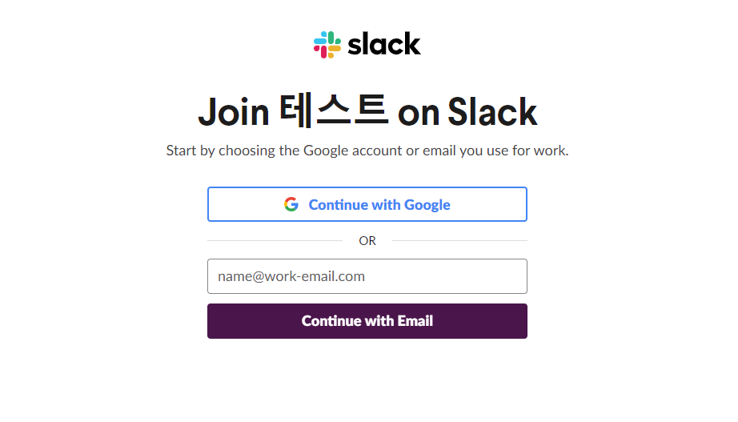
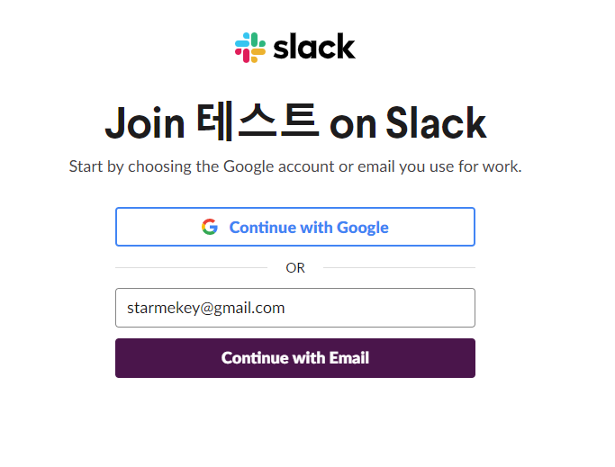
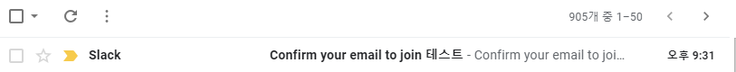
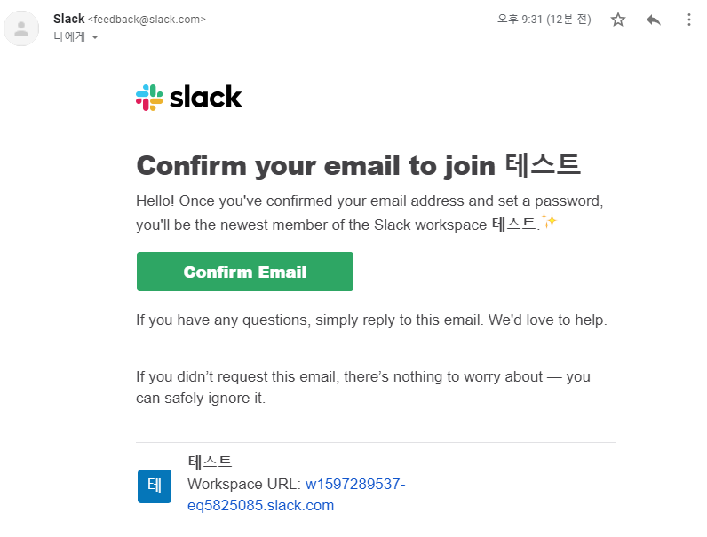
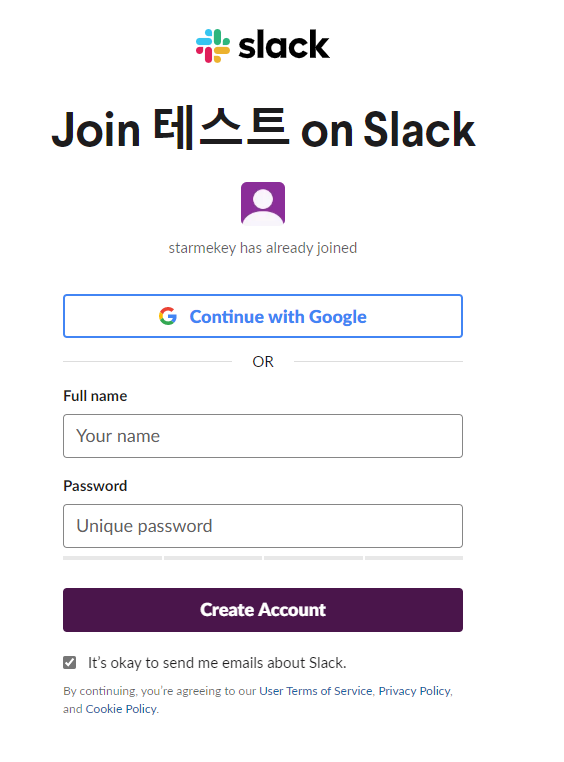
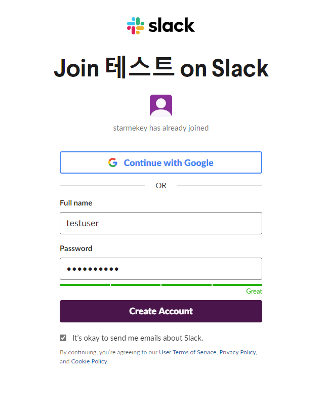
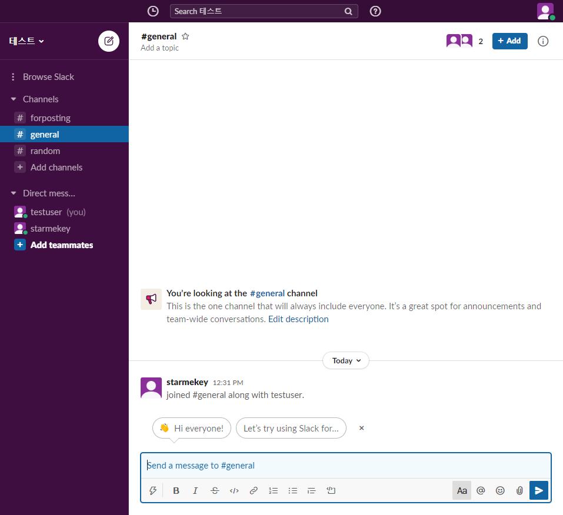

## slack

slack은 요즘 대세인 협업툴입니다. 대세가 된 프로그램인만큼 사용에 크게 어렵지 않은 편이지만 처음 접하면 어색할 수 있습니다. 그런 입문자들을 위해 간단하게 초대 링크를 통해 팀에 조인하는 방법과 이름을 바꾸고 채널에 조인하는 방법 등을 포스팅해보겠습니다.

## join

관리자로부터 직접 초대 메일을 받는다면 좀 더 쉽지만 초대 링크를 클릭하면 아래와 같은 화면이 나옵니다

'Continuew with Google'을 클릭하면 google id를 통해 진행이 가능하고 아래 'name@work-email.com' 부분에 이메일 주소를 입력하고 'continue with email'을 클릭하면 이메일 주소를 통해 진행이 가능합니다. 본 포스팅에서는 메일 주소를 통해 진행해보겠습니다.

위와 같이 본인 메일 주소를 넣고 continuew wit Email 버튼을 클릭하면

화면이 위와 같이 바뀝니다. slack에서 입력한 주소로 메일을 발송했으니 확인 후 컨펌해달라는 내용입니다. 해보죠

naver, daum, google 등 입력한 메일을 서비스하는 페이지로 가서 로그인하고 메일함을 열어보면 (저같은 경우는 gmail을 입력했으니 구글로 접속해 메일함을 열었습니다)

slack에서 보낸 메일이 도착해있는 걸 확인할 수 있습니다. 클릭해서 열어보면

메일 내용은 위와 같습니다. 여기서 초록색 'Confirm Email' 버튼을 클릭하면

위와 같은 새창이 뜹니다.

이 곳의 Full Name과 password 부분에 사용할 이름과 비밀번호를 입력하고

'Create Account' 버튼을 누르면

마침내 슬랙이 새창으로 열리고 초대 링크를 받은 채널에 접속된 걸 확인할 수 있습니다

## 프로필 변경
